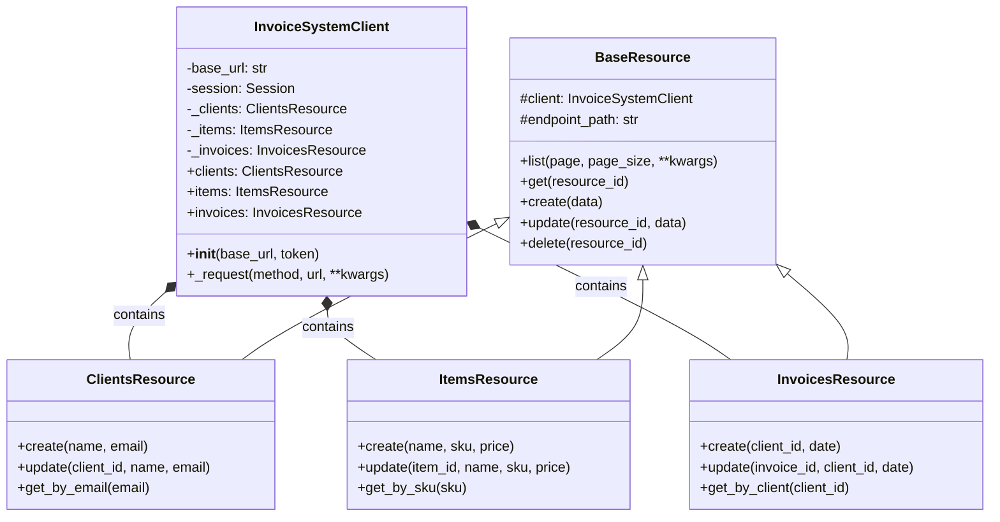

# Django Fluent API Demo

> This repo shows how to turn a raw REST API into a fluent, typed, and discoverable SDK
> similar to what you get with OpenAI or AWS client libraries.

---

## 🔴 Before vs 🟢 After: Developer Experience

### 🔴 Before: Consuming a typical REST API

```python
import requests

BASE_URL = "http://127.0.0.1:8000/api/v1/"
TOKEN = "your-token"

response = requests.post(
    f"{BASE_URL}/clients/",
    headers={"Authorization": f"Bearer {TOKEN}"},
    json={
        "name": "Juan Pérez",
        "email": "juan@example.com"
    }
)

if response.status_code != 201:
    raise Exception(response.json())

client_data = response.json()

# Then later...
response = requests.get(
    f"{BASE_URL}/clients/{client_data['id']}/",
    headers={"Authorization": f"Bearer {TOKEN}"}
)

client = response.json()
```

---

### 🟢 After: Using a fluent and typed SDK

```python
from sdk import InvoiceSystemClient

client = InvoiceSystemClient(
    base_url="http://127.0.0.1:8000/api/v1/",
    token="your-token"
)

new_client = client.clients.create(
    name="Juan Pérez",
    email="juan@example.com"
)

client_data = client.clients.get(new_client["id"])
```

**What improves:**

* ✅ IDE autocompletion and discoverability
* ✅ Strong typing for inputs and outputs
* ✅ No URLs, headers or HTTP details in business code
* ✅ Clear, resource-oriented API
* ✅ The SDK *is* the documentation

---

## Objective

Demonstrate how a well-designed SDK can dramatically improve **Developer Experience (DX)**
when consuming a REST API, using strong typing, resource-oriented design, and a fluent interface.

This project is intentionally simple and educational, focusing on SDK ergonomics rather than API complexity.

---

## Architecture and Implemented Patterns

The patterns below are the foundation that enable the "After" experience shown above.

### 1. **Client Library Pattern**

A centralized client (`InvoiceSystemClient`) acts as a single entry point, managing configuration,
authentication, and the HTTP session.

```python
client = InvoiceSystemClient(
    base_url='http://127.0.0.1:8000/api/v1/',
    token='your-token'
)
```

---

### 2. **Resource-Oriented Design (ROD)**

Each API resource (clients, items, invoices) is represented by its own class with clear, explicit methods.

This enables:

* **Discoverability**: IDEs suggest available resources and methods
* **Extensibility**: Resource-specific logic lives in the right place
* **Organization**: A clean and predictable structure

```python
client.clients.create(name="Juan", email="juan@example.com")
client.items.list()
client.invoices.get(1)
```

---

### 3. **Fluent / Discoverable API**

The SDK is designed to be self-documented through Python’s type system.
As developers type, the IDE guides them through valid operations.

```python
# The IDE automatically suggests:
client.clients.create(  # name: str, email: str
```

---

### 4. **Strong Typing + Schemas**

* Complete **type hints** on all public methods
* **TypedDict** models for API responses
* Clear separation between domain concepts

```python
from sdk import ClientData

client_data: ClientData = client.clients.create(
    name="Juan",
    email="juan@example.com"
)
```

---

## Project Structure

```
.
├── invoicing/              # Django app with REST API
│   ├── models.py          # Data models
│   └── api/v1/
│       ├── serializers/   # DRF serializers
│       ├── views/         # DRF ViewSets
│       └── urls.py        # API routes
│
├── sdk/                   # Client SDK
│   ├── __init__.py        # Main exports
│   ├── client.py          # Main client and resources
│   └── models.py          # Typed models (TypedDict)
│
├── usage_demo.py          # Usage examples
└── requirements.txt       # Dependencies
```

---

## SDK Usage

### Installation

```bash
pip install -r requirements.txt
```

### Basic Example

```python
from sdk import InvoiceSystemClient

client = InvoiceSystemClient(
    base_url='http://127.0.0.1:8000/api/v1/',
    token='optional-token'
)

new_client = client.clients.create(
    name="Juan Pérez",
    email="juan@example.com"
)

clients = client.clients.list()

client_data = client.clients.get(new_client['id'])
```

---

## TODO / Next Steps

* **Robust error handling**: Custom exceptions (`NotFoundError`, `ValidationError`, etc.)
* **Typed request models**: Separate models for Create / Update operations
* **Async / await support**: Async SDK variant using `httpx`
* **Retries and timeouts**: Safe defaults inspired by production-grade SDKs

---

## Class Structure Diagram


