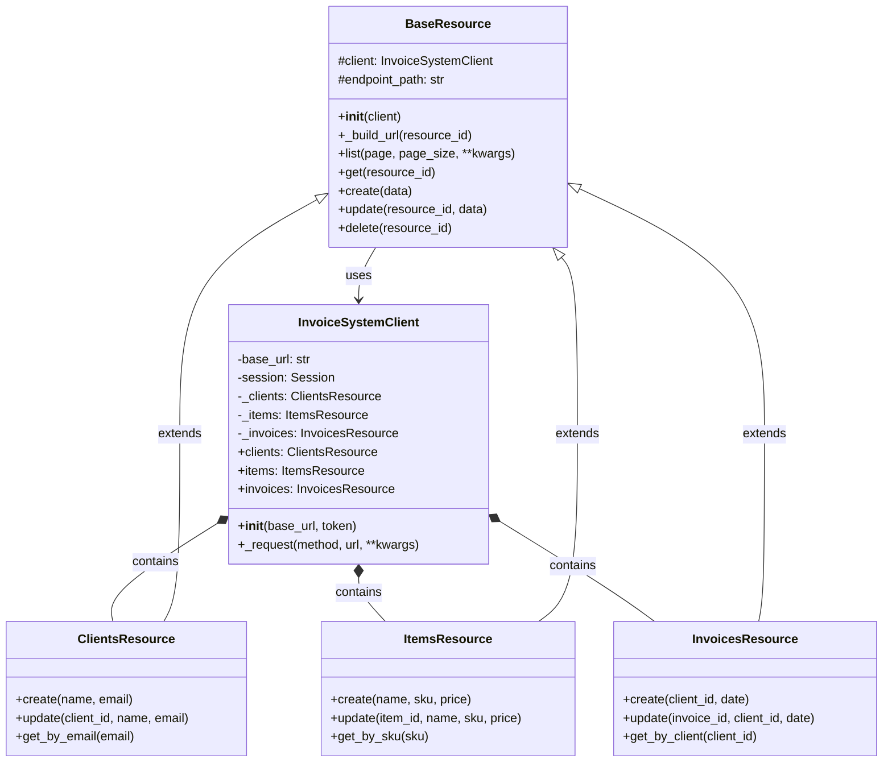

# Django Fluent API Demo

A modern and typed SDK for REST APIs, implementing some interesting design patterns.

## Objective

This project try to demonstrates how to build an SDK that significantly improves **Developer Experience (DX)** when consuming a REST API. The devolper will interact with typed objects and a fluent API.

## Architecture and Implemented Patterns

### 1. **Client Library Pattern**
The centralized client (`InvoiceSystemClient`) acts as a single entry point, managing configuration, authentication, and HTTP session.

```python
client = InvoiceSystemClient(
    base_url='http://127.0.0.1:8000/api/v1/',
    token='your-token'
)
```

### 2. **Resource-Oriented Design (ROD)**
Each API resource (clients, items, invoices) is an independent class with own methods. This allow:
- **Discoverability**: The IDE automatically suggests available resources
- **Extensibility**: Easy to add resource-specific methods
- **Organization**: Clean and well-structured code

```python
client.clients.create(name="Juan", email="juan@example.com")
client.items.list()
client.invoices.get(1)
```

### 3. **Fluent / Discoverable API**
The API is self-documented with Python type system. IDE autocompletion guides the developer:

```python
# The IDE automatically suggests:
client.clients.create(  # Autocompletion shows: name: str, email: str
```

### 4. **Strong Typing + Schemas**
- Complete **Type Hints** on all methods
- **TypedDict** for data models
- 

```python
from sdk import ClientData, InvoiceData

client_data: ClientData = client.clients.create(
    name="Juan",
    email="juan@example.com"
)
```

## Project Structure

```
.
├── invoicing/              # Django app with REST API
│   ├── models.py          # Data models
│   └── api/v1/
│       ├── serializers/   # DRF serializers
│       ├── views/         # DRF ViewSets
│       └── urls.py        # API routes
│
├── sdk/                    # Client SDK
│   ├── __init__.py        # Main exports
│   ├── client.py          # Main client and resources
│   └── models.py          # Typed models (TypedDict)
│
├── usage_demo.py          # Usage examples
└── requirements.txt       # Dependencies
```

## SDK Usage

### Installation

```bash
pip install -r requirements.txt
```

### Basic Example

```python
from sdk import InvoiceSystemClient

# Initialize client
client = InvoiceSystemClient(
    base_url='http://127.0.0.1:8000/api/v1/',
    token='optional-token'
)

# Create a client
new_client = client.clients.create(
    name="Juan Pérez",
    email="juan@example.com"
)

# List clients
clients = client.clients.list()

# Get a specific client
client_data = client.clients.get(new_client['id'])
```

## Architecture Diagram

Basic diagram with the class structure and relationships:


